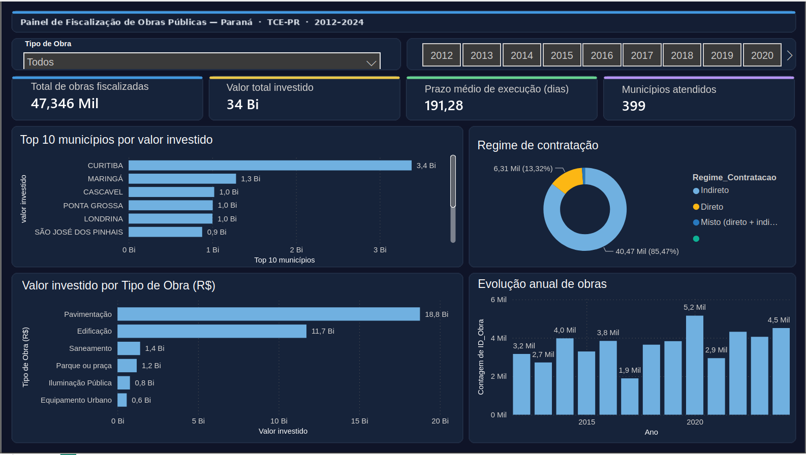
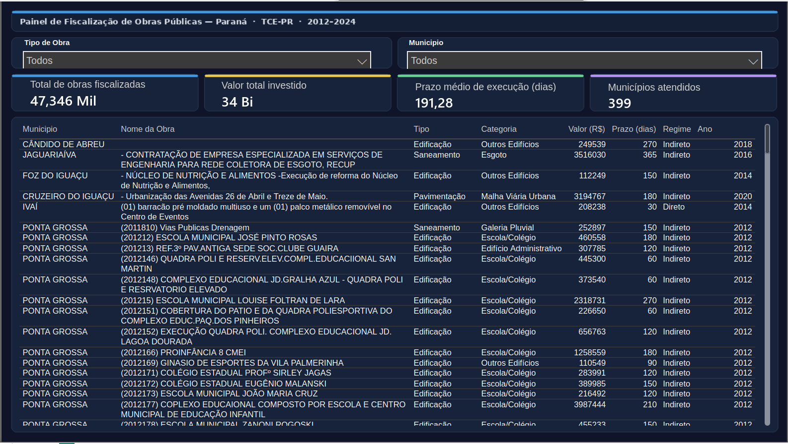

# 📊 Painel de Fiscalização de Obras Públicas — Paraná

> Dashboard desenvolvido para apoiar as atividades de fiscalização do **Tribunal de Contas do Estado do Paraná (TCE-PR)**, com dados reais de obras públicas municipais entre 2012 e 2024.

---

## 📸 Visão Geral

---

## 📋 Detalhamento

---

## 📌 Sobre o Projeto

O painel foi construído com base em dados públicos do TCE-PR e oferece uma visão analítica e interativa sobre os investimentos em obras públicas no estado do Paraná, cobrindo **47.346 obras** em **399 municípios** entre 2012 e 2024.

---

## 📈 Indicadores

| Indicador | Valor |
|---|---|
| Total de obras fiscalizadas | 47.346 |
| Valor total investido | R$ 34 bilhões |
| Prazo médio de execução | 191 dias |
| Municípios atendidos | 399 |

---

## 📊 Página 1 — Visão Geral

Apresenta os principais indicadores e gráficos consolidados:

- **Top 10 municípios** por valor investido
- **Regime de contratação** — Direto, Indireto e Misto
- **Valor investido por tipo de obra** — Pavimentação, Edificação, Saneamento e outros
- **Evolução anual de obras** — crescimento do investimento público entre 2012 e 2024

Filtros interativos por **Tipo de Obra** e **Ano**.

---

## 🔎 Página 2 — Detalhamento

Tabela completa e navegável com todas as obras, contendo município, nome da obra, tipo, categoria, valor, prazo, regime de contratação e ano.

Filtros interativos por **Município** e **Tipo de Obra**.

---

## 🗃️ Fonte dos Dados

| Item | Detalhe |
|---|---|
| Origem | Portal de dados do TCE-PR |
| Período | 2012 a 2024 |
| Total de registros | 53.052 obras |
| Registros analisados | 47.346 |
| Municípios cobertos | 399 municípios do Paraná |

---

## 🛠️ Tecnologias

- **Microsoft Power BI Online** — modelagem, visualização e publicação
- **Power Query** — tratamento e transformação da base de dados

---

## 🚀 Como Usar

1. Baixe o arquivo `Fiscalizacao_Obras_PR_TCE.pbix`
2. Abra no **Power BI Desktop** (gratuito)
3. Se necessário, atualize o caminho do CSV em: `Página Inicial → Transformar dados → Configurações da fonte de dados`
4. Navegue entre as páginas **Visão Geral** e **Detalhamento**
5. Use os filtros para segmentar os dados

---

## 👤 Autor

Desenvolvido para o **Tribunal de Contas do Estado do Paraná — TCE-PR**
Área de fiscalização de obras, contratos e contas municipais.

---

## 📄 Licença

Dados de origem pública — TCE-PR. Uso permitido para fins institucionais e de transparência pública.
